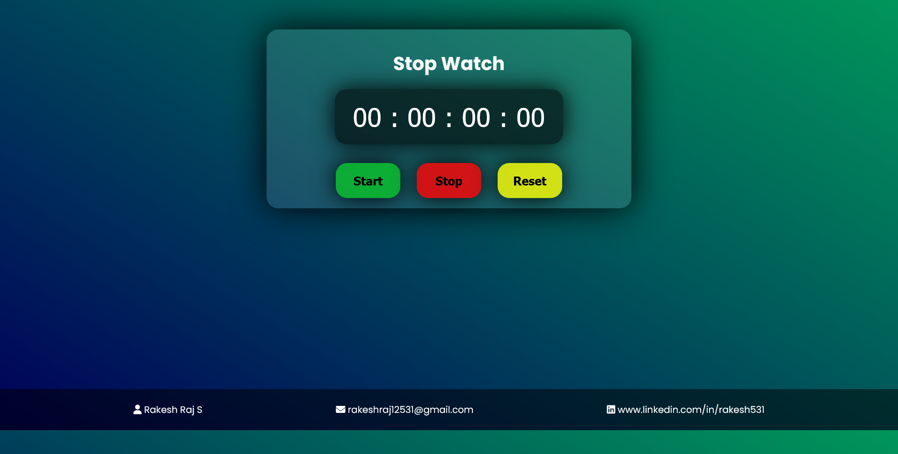

# ⏱️ Stopwatch Web App ⏳

Track time like a pro with this sleek and minimal **Stopwatch Web App** ⚡  
Crafted with raw HTML, CSS, and JavaScript by your frontend warrior — **Rakesh Raj S.** 👨‍💻💥

---

## 🌄 Sneak Peek – Project Preview 🖼️

📟 Clean layout. Millisecond precision.  
It’s not just a stopwatch — it’s an experience 😮‍💨

---

## 🎥 YouTube Walkthrough – Watch It in Action 🎬

▶️ Demo Video – Don't blink, or you’ll miss milliseconds ⏯️  
🔗 https://youtu.be/0vYIfv-MIa0

---

## 🌐 Live Demo – Try It Out in Real-Time 🧪

🔗 [Play with Time](https://rakesh12531.github.io/stopwatch_web_project/)

⏰ Stop. Start. Reset. Repeat.

---

## 🚀 Features That Hit Different

⏯️ Start, Stop & Reset Controls  
⏳ Real-Time Millisecond Timer  
🎨 Stylish UI  
⚡ Lightweight & Blazing Fast  
💡 Beginner-friendly codebase  

---

## 🧰 Tech Stack – No Frameworks, Just Skill 🧠

🔹 HTML – Markup & structure  
🔹 CSS – Styling and layout  
🔹 JavaScript – Functionality & logic  
🔹 Font Awesome – Iconic sauce ✨  
🔹 GitHub Pages – Hosting like a boss 🚀

---

## 👨‍💻 Author – That’s Me 😎

Coded with coffee ☕ and ❤️ by **Rakesh Raj S.**  
A creative dev on a mission to build, learn, and inspire 🌱

📧 Email: [rakeshraj12531@gmail.com](mailto:rakeshraj12531@gmail.com)  
🔗 LinkedIn: [linkedin.com/in/rakesh531](https://linkedin.com/in/rakesh531)  
🐙 GitHub: [github.com/rakeshraj531](https://github.com/Rakesh12531)

---

## 📚 What You’ll Learn

🛠️ DOM manipulation in JavaScript
🎯 Event handling  
🧼 Clean code structure  
💡 Real-world timer logic

---

## 🌟 Show Some Love

✨ Clone it  
🛠️ Customize it  
💥 Break it & Fix it  
⭐ Star it if it made you go “Daaaamn” 💫

---
